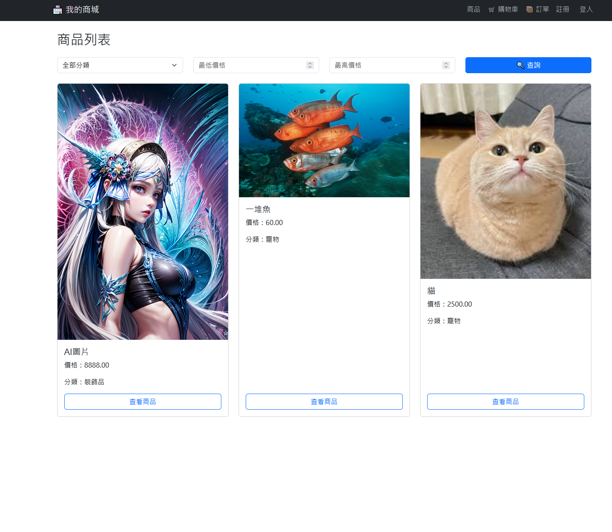
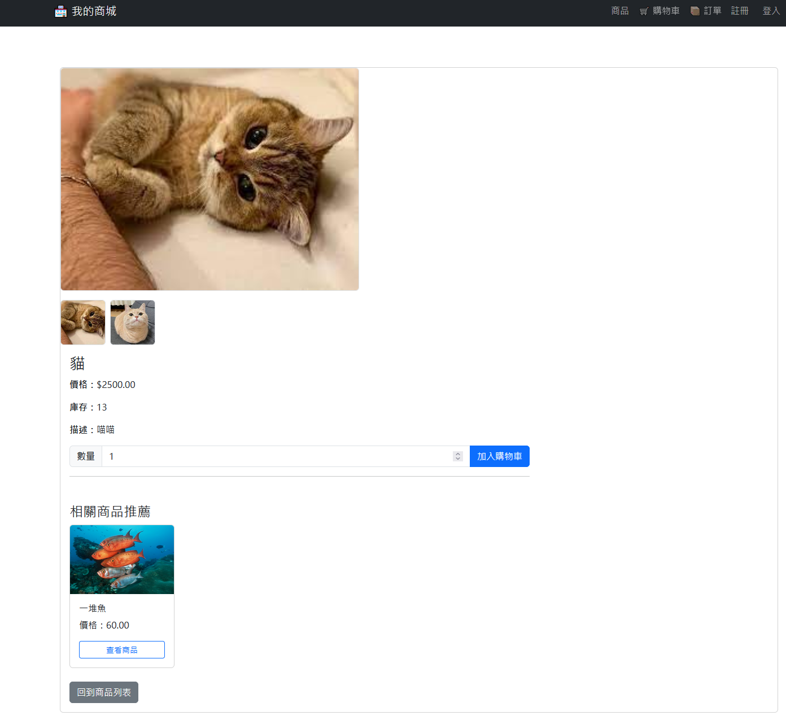
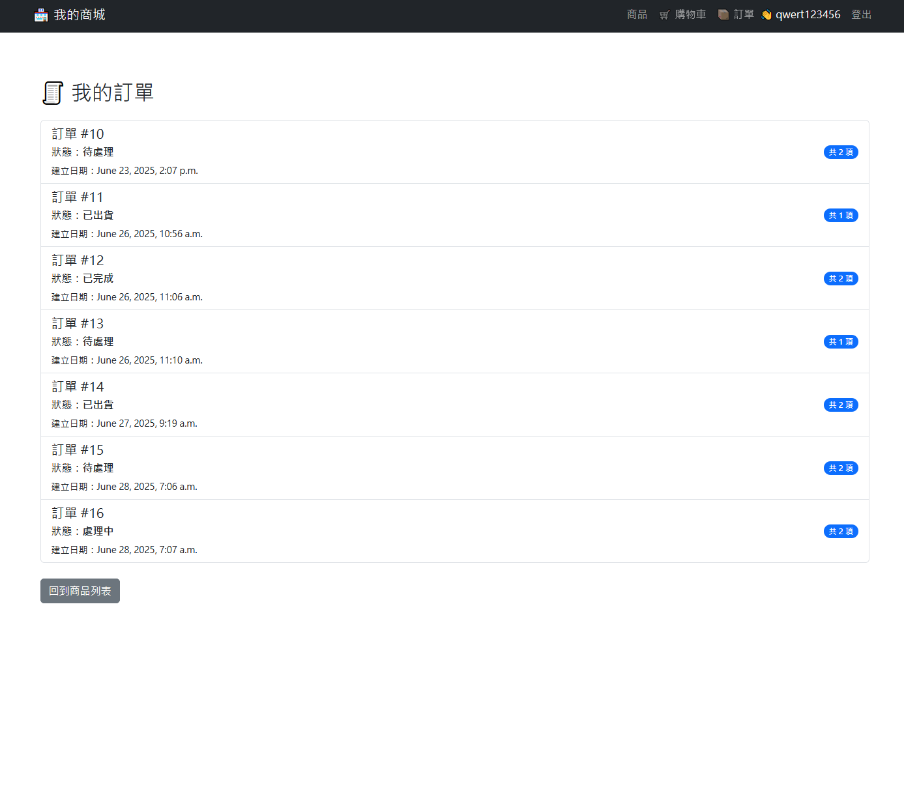
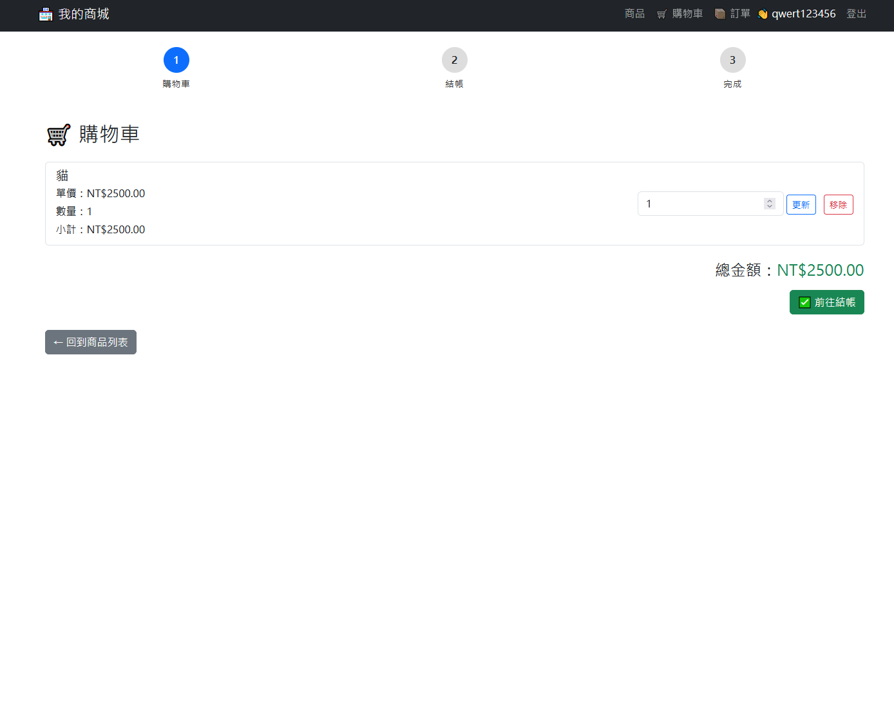
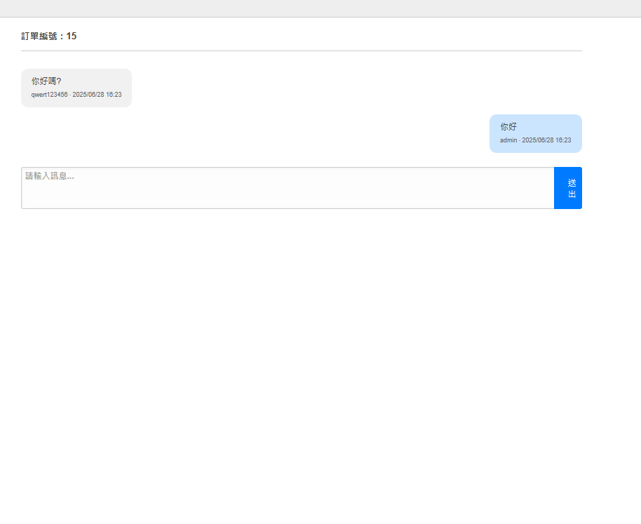
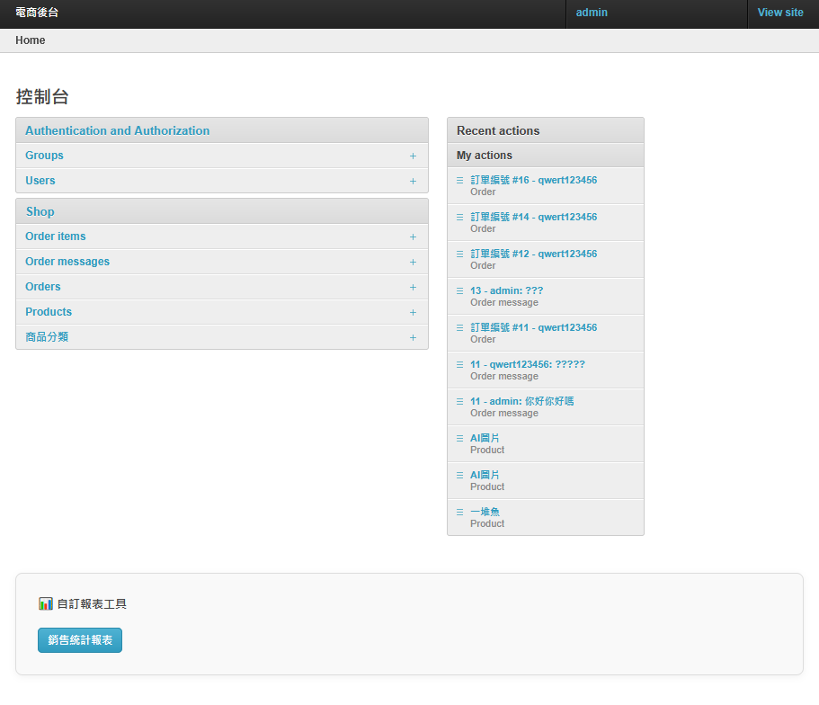

✅ 完整版 README.md（含前台功能）

# 🛍️ Django 電商後台系統 (E-Commerce Backend with Admin Chat System)

這是一個使用 **Django + PostgreSQL** 開發的完整電商管理系統，整合後台與前台功能，支援商品瀏覽、下單、訂單管理與客服留言功能，並透過 Bootstrap & Grappelli 提供美觀且實用的操作介面。

---

## 🔧 專案技術

- **後端框架**：Django 5.2+
- **資料庫**：PostgreSQL（Render 雲端服務）
- **前端樣式**：Bootstrap 5、Jinja2
- **後端樣式**：Grappelli
- **系統管理**：Django Admin 自訂頁面
- **其他工具**：Python 3.12、Git、PyCharm

---

## 📦 已實作功能

### 🛒 前台功能
- 🔍 **依分類與價格區間查詢商品**
- 🧑 **使用者註冊 / 登入系統**
- 🛍️ **商品詳情頁**（支援圖片輪播 + 類似商品推薦）
- 🛒 **購物車管理**（新增、修改數量、刪除商品）
- 📦 **訂單追蹤頁面**（顯示訂單明細與狀態）
- 💬 **客服留言回報功能**（用戶可留言，後台管理員可回覆）
- 🎨 **全站導覽列與介面美化（Bootstrap）**

### 🧰 後台功能
- 📋 **訂單管理**（查詢、篩選、排序）
- 📦 **訂單商品明細（OrderItem Inline）**
- 💬 **留言回覆介面**（類似 Facebook 對話視圖，左右訊息氣泡）
- 🗂️ **商品管理**（分類、價格、圖片、庫存）
- 📊 **總金額、總數量計算與顯示**
- 🛡️ **後台留言無法編輯 / 僅可新增 & 顯示 / 按身份分辨訊息位置**

---

## 🛠️ 安裝步驟（本地開發環境）

```bash
# 1. 建立虛擬環境
python -m venv .venv
source .venv/bin/activate  # Windows: .venv\Scripts\activate

# 2. 安裝相依套件
pip install -r requirements.txt

# 3. 套用資料庫遷移
python manage.py migrate

# 4. 建立管理員帳號
python manage.py createsuperuser

# 5. 啟動伺服器
python manage.py runserver

📂 專案結構簡介

├── config/             # Django 主設定
├── shop/               # 電商邏輯：商品、訂單、留言等
├── users/              # 使用者註冊登入系統
├── templates/          # 前台與後台自訂模板
├── static/             # Bootstrap/CSS/JS 靜態資源
├── media/              # 上傳圖片資料夾
├── requirements.txt    # 套件依賴列表
└── manage.py

🔐 資料庫設定（Render 免費 PostgreSQL）

📸 頁面展示 Screenshots
```
🛍️ 1. 前台商品列表與搜尋畫面  
  
支援商品分類、名稱關鍵字查詢與價格區間過濾：

📄 2. 商品詳情頁（含輪播與推薦）  
  
展示商品圖片輪播與相似商品推薦區塊：

🚚 3. 訂單追蹤畫面  
  
顯示用戶的訂單狀態與歷史訂單明細：

🛒 4. 購物車畫面  
  
可查看商品、修改數量、刪除與前往結帳：

💬 5. 後台留言介面（左右氣泡對話）  
  
模擬蝦皮樣式的客服系統，區分客戶與管理員訊息：

🧩 6. Grappelli 美化後台首頁  
  
使用 Django Grappelli 強化後台整體視覺與功能體驗：

🔜 下一步規劃（延伸開發）

    ☁️ 使用 Docker 打包部署至 Linux 容器

    🌐 製作 REST API 路由（Django REST Framework）

    🧪 撰寫自動化測試與 CI/CD 配置

    🚀 部署至免費平台如 Vercel / Railway / Render

    🖼️ 深入學習 HTML + Bootstrap 模板整合

    🧠 練習 JS / 前端互動功能（適度學習 Vue / React）

## 🔌 API 功能 (Django REST Framework)

本專案同時支援 API-only 模式，後端以 Django REST Framework 撰寫。

- `/api/products/`：商品列表 (支援 GET)
- `/api/products/{id}/`：商品詳情 (支援 GET)
- `/api/cart/`：購物車操作 (支援 GET/POST/PATCH/DELETE)
- `/api/orders/`：建立訂單與訂單列表
- `/api/orders/{id}/`：訂單詳情
- `/api/messages/`：訂單留言系統（支援 GET/POST）

API 文件已整合 drf-spectacular 與 Swagger UI，開發者可直接透過瀏覽器檢視完整介面：

🔗 Swagger 文件：`http://127.0.0.1:8000/api/docs/`  
🔗 OpenAPI Schema：`http://127.0.0.1:8000/api/schema/`

📮 開發者資訊

由 Jimmy Lin 開發與設計
目前正轉職進修中，歡迎聯繫洽談合作或面試邀約 🙌